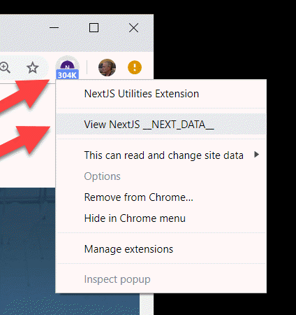
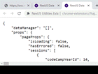
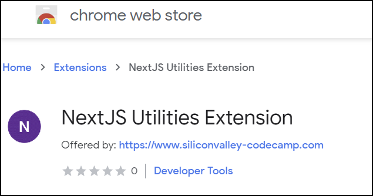
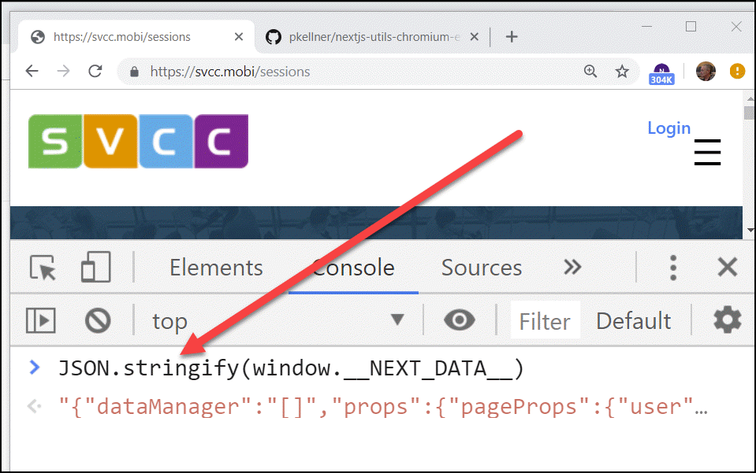

__TLDR;__ Install the Google Chrome extension Utilities Extension" and quickly see both the size and data associated with your [Next.js](https://nextjs.org/) server side rendered [React](https://reactjs.org/) app. That is, the static data included in your first page download. Using this information, you can reduce the size of that static data downloaded and make your web pages load faster for your users.

* 

Showing Size of __NEXT_DATA__ as 304K

* 

Right-mouse Button, View __NEXT_DATA_JS Results

## Installing and Using This Chome Extension

* 

Install https://chrome.google.com/webstore/detail/nextjs-utilities-extensio/ffcogmoganomoabikgmcmckdgojnpldo From Chrome Extensions Store

All you need to do to use this extension is go to the Chrome Extension Store and search for "NextJS" or click on this [URL](https://chrome.google.com/webstore/detail/nextjs-utilities-extensio/ffcogmoganomoabikgmcmckdgojnpldo).

You'll now have a purple icon on your toolbar as shown above with the letter "N" in it. If you are on a page that is generated with Next.js (like my example page https://svcc.mobi, the next thing is to click on the "N" toolbar icon. Immediately, the size of the Next.js static __window.\_\_NEXT\_DATA\_\___ will be down (that's the 384K shown in the above image). Just FYI, K means kilobytes, M means megabytes and b means bytes. If your page was not generated by a Next.js app, "n/a" will be shown for not applicable.

If you want to see the actual data, right mouse button on the toolbar icon and click the context menu choice "View NextJS Data". That way, if your __NEXT_DATA__ is large, you can visually see where the problem is. Notice in my example, it's 384K. That's huge! What I need to do is go back to my application and reduce the size by downloading only the session data I need to display and not a lot of other data I don't use.

## First Page Download Problem With SPA's

The Achilles heel of Single Page Apps (SPA's) is that the first time a web page that is viewed, there is a long delay between when a the user lands on the page and the browser user sees any data. This problem is known as "the first page download problem". You can read an authoritative post on this topic by Guillermo Raunch titled ["7 Principles of Rich Web Applications - Server Rendered Pages Are Not Optional"](https://rauchg.com/2014/7-principles-of-rich-web-applications/#server-rendered-pages-are-not-optional).

To mitigate this problem in [React](https://reactjs.org/), the most popular single page app (SPA) framework out there, written and used by [Facebook](https://reactjs.org/), is to first run the app inside of the server before the response from the first request is made, and then download all that HTML on the first request. Since the JavaScript can all be run inside the server with [Node.JS](https://nodejs.org/en/), and, React has built in support for doing that through a method named [renderToString](https://reactjs.org/docs/react-dom-server.html#rendertostring), this is easy, but with one caveat.

What happens if the web page you are rendering includes data that is asynchronously loaded on it such as data that is retrieved from an external service (like a REST service for example). Now, when the Node server figures out all your HTML to download, it must also complete those REST service calls synchronously before responding with the full HTML. Not only that, That REST data now represents the "State" of the SPA, and so that REST data must also be downloaded along with the the HTML so that after the page downloads, it can be "re-hydrated" with that State data to continue working like a normal web page.

## How The Chrome Extension Works

Chrome extensions that do this kind of thing can be tricky to write because they don't easily interact with the JavaScript execution context running on any give web page. They are good at reading the static HTML and running JavaScript in their own isolated execution context, but getting to the actual execution context of the page is tricky. Luckily (and hopefully), for you it will just work.

You can think of what this extension does is no more complex than opening up chrome debug tools and going to the console window on a page generated by an app written in Next.js. Then, typing at the command prompt: __JSON.stringify(window.\_\_NEXT\_DATA\_\_).__ This chrome extension just gives you a short cut to this as well as a nice way to see the actual data formatted in JSON.

Viewing __NEXT_DATA__ in the Chrome Dev Tools console

## What Could Go Wrong?

I'm writing this because even though I wrote this extension and use it heavily to keep my first page download size down to a reasonable size, over and over again, I make the same mistake.

I first browse to a page like https://svcc.mobi and then click on the "sessions" menu choice. Following that, I click on the Chrome Extension toolbar icon. I see 2K when I think I should be seeing a much large number (like 304K). The reason is I did a "client side" link to my sessions page and the original page downloaded was from the home page which indeed, only had a 2K __NEXT_DATA__ object.

What I need to do is reload that page I'm on by positioning my cursor to the URL bar, selecting the current URL (https://svcc.mobi/sessions), and then pressing enter to get a new request sent to the server. Now, pressing the Chrome extension icon will show the correct size of 304K that I expected.

## Looking for Feedback

I'd love feedback on this extension as well as suggestions for how to enhance. Please post issues to the GitHub repo where this extension lives with that.

[https://github.com/pkellner/nextjs-utils-chromium-extension](https://github.com/pkellner/nextjs-utils-chromium-extension)

Want To Know More About Developing Apps with Next.js?

You can head over to the awesome [getting started docs](https://nextjs.org/learn/basics/getting-started) on the Next.js site or even better, you can watch my two hour course on [Pluralsight](https://www.pluralsight.com/?clickid=yEHV9rz0pxyOT-UwUx0Mo3cjUknWxtQdwzzg1M0&irgwc=1&mpid=1196644&utm_source=impactradius&utm_medium=digital_affiliate&utm_campaign=1196644&aid=7010a000001xAKZAA2) titled ["Building Server-side Rendered React Apps"](https://www.pluralsight.com/courses/using-react-hooks). If you don't have a Pluralsight account, you can click on [this link](https://www.pluralsight.com/?clickid=yEHV9rz0pxyOT-UwUx0Mo3cjUknWxtXFwzzg1M0&irgwc=1&mpid=1196644&utm_source=impactradius&utm_medium=digital_affiliate&utm_campaign=1196644&aid=7010a000001xAKZAA2) and get a free trial and watch my full course before committing any money. You could also watch [my other 8 courses](https://app.pluralsight.com/profile/author/peter-kellner) and I would not complain about that :)

Thanks for reading.
