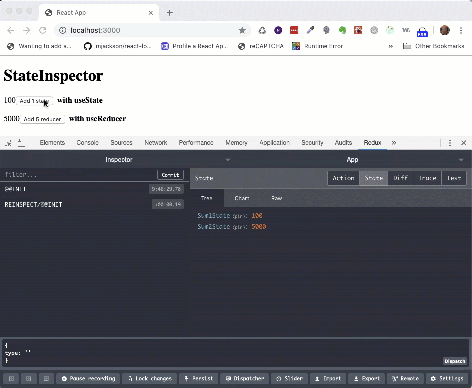

## **Background**

Yes, you can use the very cool Chrome extension [Redux DevTools](https://chrome.google.com/webstore/detail/redux-devtools/lmhkpmbekcpmknklioeibfkpmmfibljd?hl=en) with [React Hooks](https://reactjs.org/docs/hooks-intro.html). You may have bumped into lots of articles that say one of the downsides of using React Hooks with useReduce and useState, instead of react-redux is that you loose the awesome development experience that comes with react-redux. Well, that’s just wrong. Using the npm package `reinspect` you can see state changes.

Below is a the JavaSript and you can find the full github repo with this example here:

[github.com/pkellner/debug-react-hooks-with-redux-devtools](github.com/pkellner/debug-react-hooks-with-redux-devtools)



And the associated code is below. Notice how `useState` and `useReducer` are imported from `reinspect` and not `react`.

```js 
import React from "react";
import ReactDOM from "react-dom";

import { StateInspector, useState, useReducer } from "reinspect";

function CounterFunState() {
  const [sum1, setSum1] = useState(100, "Sum1State");
  return (
    <>
      {sum1}
      <button onClick={() => setSum1(sum1 + 1)}>Add 1 state</button>&nbsp;&nbsp;<b>with useState</b>
    </>
  );
}

function CounterFunReducer() {
  const reducer = (state) => {
    return state + 5;
  };
  const [sum2, dispatch] = useReducer(reducer, 5000, "Sum2State");
  return (
    <>
      {sum2}
      <button onClick={() => dispatch({})}>Add 5 reducer</button>&nbsp;&nbsp;<b>with useReducer</b>
    </>
  );
}

function Counter() {
  return (
    <>
      <StateInspector name="App">
        <h1>StateInspector</h1>
        <CounterFunState /><br/><br/>
        <CounterFunReducer />
        <br/><br/>
      </StateInspector>
    </>
  );
}

ReactDOM.render(<Counter />, document.querySelector("#root"));
```

There are just two things that you need to do in your code to make `useState` and `useReducer` work in your app.

1. You need to surround your components that include `useState` and `useReducer` with the `<StateInspector>` element.
2. You need to make sure that you import `useState` and `useReducer` from the npm package `reinspect` and not `react`.

That is. The chrome extension `redux-devtools` will now just work as you would expect.

As an aside, if you do want to learn more about React Hooks, Checkout my Pluralsight course (2 hours) and learn all about them.

[www.pluralsight.com/courses/using-react-hooks](www.pluralsight.com/courses/using-react-hooks)

Hope this helps.